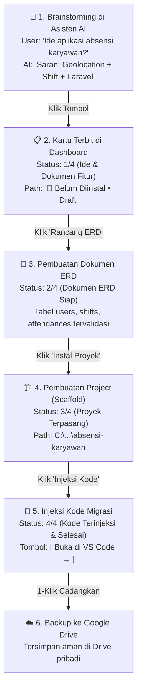

# 🏛️ DEVArchitect: Master Architecture & Product Roadmap
### Cetak Biru Final: End-to-End Ideation, Database Engine, Lifecycle Progress & Zero-Cost Cloud Sync

Dokumen ini adalah **panduan arsitektur resmi dan cetak biru final (*final master blueprint*)** untuk aplikasi desktop **DEVArchitect**. Dokumen ini menyatukan seluruh spesifikasi fitur: perancangan ide di Asisten AI, sistem deteksi database lokal, visualisasi ERD nol token, siklus hidup proyek bertahap di Dashboard, hingga sinkronisasi portabilitas cloud menggunakan Google Drive API.

---

## 📑 Daftar Isi
1. [Visi Produk & 4 Pilar Utama](#1-visi-produk--4-pilar-utama)
2. [Alur Pengalaman Pengguna (End-to-End User Experience)](#2-alur-pengalaman-pengguna-end-to-end-user-experience)
   * 2.1 [Jalur A: Idea-to-Code (Proyek Baru dari Nol)](#21-jalur-a-idea-to-code-proyek-baru-dari-nol)
   * 2.2 [Jalur B: Existing Project Adoption (Proyek yang Sudah Berjalan)](#22-jalur-b-existing-project-adoption-proyek-yang-sudah-berjalan)
   * 2.3 [Matriks Skenario, Lompatan Tahap & Penanganan Kondisi](#23-matriks-skenario-lompatan-tahap--penanganan-kondisi-flexible-state-machine)
   * 2.4 [Pencegahan Kesalahan: Smart Pre-Locking & Dimming di Generator](#24-pencegahan-kesalahan-kompatibilitas-smart-pre-locking--dimming-di-generator)
   * 2.5 [Manajemen Skalabilitas Chat & Efisiensi RAM](#25-manajemen-skalabilitas-chat--efisiensi-ram-chat-scaling--memory-footprint)
   * 2.6 [Autentikasi Pengguna & Pengawasan Admin (Cloud Identity)](#26-autentikasi-pengguna--pengawasan-admin-cloud-identity-with-offline-first-session)
   * 2.7 [Tampilan Awal Peluncuran: Premium Native Splash Screen](#27-tampilan-awal-peluncuran-premium-native-splash-screen--zero-flash-bootstrapping)
3. [Token Economics & Efisiensi Sumber Daya](#3-token-economics--efisiensi-sumber-daya)
4. [Arsitektur Teknis Komponen](#4-arsitektur-teknis-komponen)
5. [Riwayat Proyek Terpadu (Unified Project Lifecycle History & Audit Trail)](#5-riwayat-proyek-terpadu-unified-project-lifecycle-history--audit-trail)
6. [Spesifikasi Snapshot Cloud (.devarch.json)](#6-spesifikasi-snapshot-cloud-devarchjson)
7. [Master Implementation Roadmap & Checklist](#7-master-implementation-roadmap--checklist)
8. [Protokol Keamanan & Jaminan Kualitas](#8-protokol-keamanan--jaminan-kualitas)
9. [Persyaratan Sistem & Kompatibilitas Multi-Platform](#9-spesifikasi-persyaratan-sistem-system-requirements--kompatibilitas-multi-platform)

---

## 1. Visi Produk & 4 Pilar Utama

DEVArchitect dirancang bukan sekadar sebagai generator kode migrasi, melainkan sebagai **Desktop Software Architect Copilot** yang mendampingi pengembang dan orang awam dari **fase nol (obrolan ide abstrak)** hingga **fase siap koding di editor (VS Code/Zed)**.

```
┌──────────────────────────────────────────────────────────────────────────────────┐
│                             4 PILAR DEVARCHITECT                                 │
├───────────────────┬───────────────────┬───────────────────┬──────────────────────┤
│      PILAR 1      │      PILAR 2      │      PILAR 3      │       PILAR 4        │
│   AI Architectural│ Universal Database│ Lifecycle Progress│ Zero-Cost Cloud Sync │
│     Assistant     │    & ERD Engine   │    & Dashboard    │    & Portability     │
├───────────────────┼───────────────────┼───────────────────┼──────────────────────┤
│ • Ideation chat   │ • Smart DB detect │ • 4-stage pipeline│ • Google Drive API   │
│ • URD, PRD & SRS  │ • Local parser    │ • Early card init │ • Loopback OAuth 2.0 │
│ • Human-in-the-   │ • 0-token ERD view│ • Dynamic action  │ • .devarch.json pack │
│   Loop approval   │ • Migration inject│   next buttons    │ • Multi-device restore│
└───────────────────┴───────────────────┴───────────────────┴──────────────────────┘
```

---

## 2. Alur Pengalaman Pengguna (End-to-End User Experience)

Aplikasi melayani dua jalur masuk utama pengguna (*mental models*) dengan sangat mulus:

### 2.1. Jalur A: Idea-to-Code (Proyek Baru dari Nol)



1. **Langkah 1 (Brainstorming Ide & Fitur):** Pengguna berdiskusi di `/assistant`. AI merekomendasikan konsep sistem dan spesifikasi fitur (contoh: Sistem Absensi Karyawan dengan Geolocation).
2. **Langkah 2 (Early Card Initialization):** Tepat di bawah respons AI, muncul tombol konfirmasi:
   > 💡 **Konsep Disepakati: Sistem Absensi Karyawan (Geolocation)**  
   > Framework: `Laravel` · Database: `PostgreSQL`  
   > **`[ + Jadikan Proyek di Dashboard ]`**
   
   Mengklik tombol ini langsung menerbitkan kartu baru di Dashboard dengan status **`Tahap Ide & Dokumen (1/4)`**, tanpa perlu instalasi folder fisik terlebih dahulu.
3. **Langkah 3 (Pembuatan Dokumen ERD & Validasi Skema):**
   * Pengguna mengklik tombol **`[ Rancang Dokumen ERD → ]`**.
   * AI menyusun diagram ERD visual berdasarkan dokumen fitur yang telah disepakati (tabel `users`, `shifts`, `attendances`, relasi foreign key).
   * Pengguna dapat meninjau dan merevisi struktur tabel di Canvas ERD terlebih dahulu.
   * Progres kartu naik ke **`2/4 (Dokumen ERD Siap)`**.
4. **Langkah 4 (Pembuatan / Instalasi Proyek - Scaffold Folder):**
   * Setelah dokumen arsitektur dan ERD disetujui, pengguna mengklik **`[ Buat & Instal Proyek Ini → ]`**.
   * Modal instalasi terbuka dengan nama proyek dan framework yang sudah otomatis terisi. Pengguna cukup memilih lokasi direktori di komputernya.
   * Sistem men-scaffold folder framework (Laravel/Express/Spring Boot) ke komputer.
   * Path folder tercatat dan progres kartu naik ke **`3/4 (Proyek Terpasang di Komputer)`**.
5. **Langkah 5 (Injeksi Kode Migrasi & Model):**
   * Setelah folder proyek fisik terbentuk, pengguna mengklik **`[ Injeksi Kode Migrasi → ]`**.
   * Berkas migrasi database dan model ORM yang bersumber dari ERD Langkah 3 diinjeksi langsung ke dalam direktori proyek yang baru saja dibuat.
6. **Langkah 6 (Selesai, Siap Koding & Cloud Backup):**
   * Progres mencapai **`4/4 (Selesai)`**. Tombol utama menjadi **`[ Buka di VS Code → ]`**.
   * Pengguna dapat langsung membuka editor untuk koding, atau mengklik **`[ ☁️ Cadangkan ke Google Drive ]`** untuk sinkronisasi cloud.

---

### 2.2. Jalur B: Existing Project Adoption (Proyek yang Sudah Berjalan)

Bagi pengembang yang sudah memiliki folder proyek (misalnya: Express.js + Prisma + PostgreSQL):

1. **Import Folder di Dashboard:**
   * Pengguna memilih folder `backend`.
   * **Smart Auto-Detector (0 Token):**
     * Sistem mendeteksi `Express + Prisma` dari `package.json`.
     * Sistem membaca `prisma/schema.prisma`, menemukan `provider = "postgresql"`.
     * Kartu di Dashboard langsung menampilkan label presisi: **`Express + Prisma · PostgreSQL`** (bukan sekadar `SQL`).
2. **Reverse-Engineering ERD (0 Token):**
   * Sistem mem-parse model Prisma secara lokal.
   * Halaman Generator langsung menampilkan visualisasi ERD lengkap dari tabel-tabel yang sudah ada di proyek tanpa memanggil LLM.
3. **Sinkronisasi Dokumen AI Otomatis (~1.000 Token / Free Tier):**
   * Terdapat tombol: **`[ 📄 Buat Dokumentasi dari Proyek Ini ]`**.
   * Ringkasan entitas dikirim ke Asisten AI. AI langsung menyusun draft PRD, kamus data, dan spesifikasi arsitektur proyek tersebut secara otomatis.
4. **Cloud Backup:** Proyek langsung dapat dicadangkan ke Google Drive sebagai arsip portabel.

---

### 2.3. Matriks Skenario, Lompatan Tahap & Penanganan Kondisi (Flexible State Machine)

Dalam rekayasa sistem riil, pengguna tidak selalu berjalan lurus (*happy path*). DEVArchitect menerapkan prinsip **Flexible State Machine (Non-Blocking Pipeline)** di mana setiap langkah bersifat independen dan sistem secara otomatis mengevaluasi kondisi proyek untuk menyajikan tombol aksi terbaik.

#### A. Matriks Skenario Lompatan Tahap (State & Edge Cases Matrix)

| Skenario | Tindakan Pengguna | Status Progres Kartu | Penanganan Sistem (System Handling) | Tombol Aksi Utama yang Muncul |
|:---|:---|:---:|:---|:---|
| **Skenario 1 (Happy Path)** | Runtut dari awal: Ide (1) ➔ Kartu (2) ➔ ERD (3) ➔ Instal (4) ➔ Injeksi (5) ➔ Koding (6). | Berjalan bertahap: `1/4` ➔ `2/4` ➔ `3/4` ➔ `4/4` | Alur ideal. Setiap penyelesaian tahap memicu langkah berikutnya. | Dinamis sesuai tahap (Rancang ERD ➔ Instal ➔ Injeksi ➔ VS Code). |
| **Skenario 2 (Langsung Koding / Skip Chat)** | Pengguna tidak ingin brainstorming AI dan tidak butuh ERD. Langsung klik *+ Tambah Project* ➔ *Buat dari Nol*. | Langsung di: **`3/4 (Proyek Terpasang)`** | Sistem langsung men-scaffold folder framework ke disk. Tahap 1 & 2 (Dokumen & ERD) berstatus *Opsional / Belum Dibuat*. | **`[ Buka di VS Code → ]`** *(dengan opsi menu samping: 'Rancang Database AI')*. |
| **Skenario 3 (Lompat ke ERD Tanpa Dokumen)** | Pengguna langsung membuka `/generator` dan prompt skema database tanpa brainstorming di Assistant. | Langsung di: **`2/4 (Dokumen ERD Siap)`** | ERD langsung tersimpan di database lokal DEVArchitect. Folder fisik belum ada. | **`[ Buat & Instal Proyek Ini → ]`** *(Memandu pengguna membuat folder fisiknya)*. |
| **Skenario 4 (Revisi / Mundur ke Tahap ERD)** | Proyek sudah terinstal (Langkah 4), tapi pengguna ingin mengubah ERD (Langkah 3) karena ada tabel baru. | Progres tetap **`3/4`**, badge: `● Perlu Injeksi Ulang` | Pengguna dapat membuka kembali canvas ERD kapan saja. Sistem mendeteksi skema baru yang belum diinjeksi. | **`[ Update & Injeksi Ulang → ]`** *(Menjalankan deteksi konflik migrasi secara aman)*. |
| **Skenario 5 (Proyek Existing Diimpor)** | Pengguna mengimpor folder yang sudah ada (misalnya: Express + Prisma + PostgreSQL). | Otomatis di: **`3/4`** atau **`4/4`** | Local parser membaca `schema.prisma`. Folder ada (✅), ERD terbaca (✅). Jika migrasi lengkap, langsung siap koding. | **`[ Buka di VS Code → ]`** *(dengan opsi: '📄 Buat Dokumen AI dari Proyek Ini')*. |
| **Skenario 6 (Draft Abadi / Ide Ditinggalkan)** | Pengguna chat di AI, kartu terbit di Dashboard, tapi pengguna menutup aplikasi dan tidak lanjut instal. | Tetap di: **`1/4 (Draft Ide)`** | Tidak memakan ruang disk sama sekali karena folder fisik belum dibuat. Kartu tetap aman tersimpan sebagai "ide masa depan". | **`[ Lanjutkan Dokumen → ]`** *(Bisa dihapus kapan saja via menu titik tiga)*. |
| **Skenario 7 (Instalasi Gagal / Toolchain Error)** | Pengguna klik *Instal Proyek*, tapi koneksi internet terputus atau Composer/Node belum terpasang. | Tetap di: **`2/4 (Dokumen ERD Siap)`** | Sistem menampilkan modal peringatan (*"Composer belum terdeteksi"*). Folder fisik belum dibuat, sehingga data ERD tidak rusak. | Tetap: **`[ Coba Instal Lagi → ]`**. |

#### B. Logika Cerdas Tombol Aksi (Smart Decision Engine)

Setiap kartu di Dashboard mengevaluasi kondisi proyek secara real-time untuk menentukan aksi terbaik:

```php
// Logika Penentuan Aksi Tombol pada Kartu
if ($project->is_draft && !$project->has_erd) {
    // Baru berupa ide obrolan saja
    $buttonText = "Rancang Dokumen ERD →";
    $buttonAction = "/generator?from_doc=" . $project->id;
} 
elseif ($project->has_erd && !$project->has_physical_folder) {
    // ERD sudah siap, tetapi folder fisik di komputer belum dibuat
    $buttonText = "Buat & Instal Proyek Ini →";
    $buttonAction = "openScaffoldModal('" . $project->id . "')";
} 
elseif ($project->has_physical_folder && $project->has_pending_migrations) {
    // Folder ada, ERD ada, namun migrasi belum disuntikkan ke folder
    $buttonText = "Injeksi Kode Migrasi →";
    $buttonAction = "/generator?project_id=" . $project->id;
} 
else {
    // Seluruh tahapan selesai / Proyek siap pakai
    $buttonText = "Buka di VS Code →";
    $buttonAction = "openEditor('" . $project->id . "', 'vscode')";
}
```

#### C. Tiga Prinsip Perlindungan Pengguna (*Fail-Safe Principles*)

1. **Non-Blocking Architecture (Bebas Melompat):** Pengembang berpengalaman tidak dipaksa melalui obrolan AI atau ERD jika hanya ingin generate kerangka framework kosongan.
2. **Safe Re-Generation (Anti-Rusak Data):** Revisi ERD setelah koding berjalan tidak akan menimpa file kodingan pengguna secara sembarangan, melainkan membuat file migrasi tambahan (*incremental migration*) secara aman.
3. **Status Visual Transparan:** Kartu selalu memberikan informasi jujur apakah proyek masih berstatus *draft virtual* (`📁 Draft (Belum Diinstal)`) atau sudah memiliki direktori lokal (`📁 C:\...\project-name`).

---

### 2.4. Pencegahan Kesalahan Kompatibilitas: Smart Pre-Locking & Dimming di Generator

#### Masalah UX (*Post-Click Rejection*)
Sebelumnya, ketika pengguna membuka proyek aktif Laravel di halaman Generator (`/generator`), tombol framework lain seperti *Express + Prisma* tetap terlihat aktif dan bisa diklik. Pengguna baru mengetahui pilihannya dilarang setelah muncul peringatan merah pasca-klik (*post-validation*). Ini menimbulkan friksi dan kebingungan bagi pengguna.

#### Solusi Arsitektur (*Pre-Validation & Visual Locking*)
Sesuai prinsip *Error Prevention (Nielsen Heuristics)*, halaman Generator kini menerapkan **Smart Pre-Locking & Dimming**:

```
Tampilan Saat Proyek Laravel Aktif:

[ ✓ Laravel ]        [ Express + Prisma ]      [ Express + Drizzle ]      [ Spring Boot ]      [ Universal Raw SQL ]
(Aktif & Terpilih)    (🔒 Redup / Disabled)     (🔒 Redup / Disabled)      (🔒 Redup / Disabled)  (Boleh Dipilih)
                      Tooltip: "Proyek aktif                              
                      Anda adalah Laravel"                                
```

1. **Auto-Selection & Visual Lock:**
   * Tombol framework yang sesuai dengan proyek aktif (misal: `Laravel`) otomatis terpilih secara paten.
   * Tombol framework yang **tidak kompatibel** (`Express + Prisma`, `Express + Drizzle`, `Spring Boot`) langsung dibuat **redup (*opacity-30*)** dan dinonaktifkan (`disabled`, `cursor-not-allowed`).
   * Tombol `Universal Raw SQL` tetap diizinkan karena DDL SQL murni kompatibel secara universal di proyek apa pun.
2. **Contextual Hover Tooltip:**
   * Saat kursor diarahkan ke tombol yang dinonaktifkan, muncul tooltip edukatif:  
     > *"Proyek aktif Anda adalah Laravel (`toko-barang-bekas`). Framework ini terkunci agar file migrasi yang dihasilkan tidak merusak struktur proyek."*
3. **Banner Informasi Konteks:**
   * Di atas daftar pilihan framework ditampilkan badge status:  
     `🔒 Framework Terkunci Otomatis ke Laravel (Sesuai Proyek Aktif)`
   * Disediakan link pintasan bagi pengguna yang memang sengaja ingin membuat skema framework lain:  
     `[ Ganti Proyek Aktif ]` atau `[ + Buat Proyek Baru ]`.

---

### 2.5. Manajemen Skalabilitas Chat & Efisiensi RAM (Chat Scaling & Memory Footprint)

Saat fitur Asisten Dokumen AI (`/assistant`) digunakan dalam diskusi panjang hingga puluhan atau ratusan pesan, terdapat dua potensi bottleneck: **(1) Batas Konteks Token AI (Context Window & AI Amnesia)** dan **(2) Penggunaan RAM Komputer / Desktop WebView2 (DOM Bloat)**. 

Berikut strategi arsitektur DEVArchitect untuk menjaga performa tetap kencang, responsif, dan hemat sumber daya:

#### A. Strategi Konteks AI (Mencegah Amnesia & Lonjakan Biaya Token)
Jika semua riwayat percakapan dikirim mentah ke LLM, jumlah token input akan melonjak (biaya mahal / model timeout), atau jika dipotong sembarangan (`limit(10)`), AI akan mengalami *amnesia* terhadap keputusan arsitektur awal.

DEVArchitect menerapkan **Arsitektur Memori 3 Lapis (Three-Tier Memory Architecture)**:
1. **Tier 1: Lembar Dokumen Canvas sebagai Memori Utama Permanen (Single Source of Truth / SSOT)**:
   - Setiap kali hasil diskusi menyepakati fitur atau struktur tabel, draf disimpan ke Canvas dan di-*Approve*.
   - Di backend (`DocChatJob.php`), versi dokumen yang berstatus `approved` ini otomatis disuntikkan ke dalam System Prompt sebagai acuan paten.
   - **Hasil:** AI tidak akan pernah melupakan fondasi arsitektur sistem, meskipun percakapan kasualnya sudah ratusan pesan yang lalu.
2. **Tier 2: Sliding Context Window (10 Pesan Terakhir)**:
   - Hanya 10 pesan percakapan terbaru yang dikirim mentah untuk menjaga kelancaran alur tanya-jawab langsung (*turn-by-turn coherence*).
3. **Tier 3: Rolling Context Summary (Ringkasan Bergulir)**:
   - Pesan-pesan diskusi di luar 10 pesan terakhir yang belum disahkan ke Canvas dikompresi otomatis menjadi 1 paragraf ringkasan memori padat (~150–250 token) di database, menjaga konteks tanpa membakar kuota token.

```
[ Lembar Dokumen Canvas (SSOT Ter-Approve) ]  <-- Memori Utama Permanen (Bebas Amnesia)
                     ▲
[ Ringkasan Percakapan Lama (Rolling Summary) ]  <-- ~200 Token Memory Block
                     ▲
[ 10 Pesan Chat Terakhir (Sliding Window) ]    <-- Respon Natural Terkini
```

#### B. Analisis & Pengendalian Penggunaan RAM Komputer
Apakah RAM komputer akan membengkak jika obrolan sudah sangat banyak? **Jawabannya: Tidak, jika dikelola dengan arsitektur yang tepat.**

| Lapisan Sistem | Tanpa Optimasi (Risiko Konvensional) | Strategi DEVArchitect | Dampak Penggunaan RAM |
|:---|:---|:---|:---|
| **Frontend Desktop (Tauri WebView2)** | Menumpuk 500+ pesan dengan DOM tree panjang, tabel Markdown, dan tombol copy dapat membuat RAM melonjak ke **~250 MB – 400 MB** (*DOM Tree Bloat*). | **Pagination / Virtual Lazy Loading**: Halaman hanya merender **20–30 pesan terakhir** saat pertama dibuka. Tombol/indikator *"Muat 20 Pesan Sebelumnya"* mengambil riwayat lama secara bertahap saat discroll ke atas. | **RAM Stabil & Ringan: ~60 MB – 85 MB** (konstan, tidak peduli ada 20 atau 5.000 pesan). |
| **Backend PHP (Local Artisan/CLI)** | Menyimpan seluruh riwayat percakapan di RAM server. | **Stateless Per-Request Lifecycle**: PHP mengeksekusi request dalam < 25ms, lalu langsung membebaskan (*free*) memori ke sistem operasi. | **RAM Flat: ~15 MB – 25 MB** per-request, langsung dibersihkan (0 memory leak). |
| **Database SQLite (`database.sqlite`)** | Query seluruh riwayat pesan sekaligus tanpa pagination. | **Indexed Disk Query with Limit**: 1.000 pesan chat teks di SQLite hanya memakan **~1 MB – 2 MB pada file disk**. Query pagination dieksekusi dalam **< 2 milidetik**. | **RAM SQLite: < 1 MB**. |

#### C. Fitur Manajemen Sesi Obrolan Pengguna
1. **Fitur "Arsipkan Obrolan" / "Mulai Topik Baru":**  
   Pengguna dapat memulai babak diskusi baru dengan riwayat chat yang bersih kapan saja tanpa kehilangan draf dokumen yang sudah ada di Canvas.
2. **Ekspor Transkrip Diskusi (Markdown):**  
   Pengguna dapat mengunduh seluruh rekaman diskusi brainstorming ke file `.md` lokal sebelum mengarsipkan riwayat obrolan lama.

---

### 2.6. Autentikasi Pengguna & Pengawasan Admin (Cloud Identity with Offline-First Session)

Untuk mendistribusikan aplikasi ke pengguna publik, terdapat dua kebutuhan esensial: **(1) Pemilik produk perlu memantau pertumbuhan pengguna melalui Dashboard Admin**, dan **(2) Pengguna harus tetap bisa menggunakan aplikasi secara 100% offline tanpa hambatan koneksi internet**.

DEVArchitect menerapkan arsitektur **Hybrid Cloud Identity with Offline Session Caching** (seperti standar industri pada VS Code, Docker Desktop, Postman, dan Spotify):

#### A. Arsitektur Terpisah: Server Cloud vs. Desktop Client

```
┌─────────────────────────────────────────────────────────────┐
│                 SERVER CLOUD (Vercel + Supabase)            │
│  ├── 🔐 Auth API: /api/register, /api/login, /api/me        │
│  └── 👑 Halaman Dashboard Admin (Khusus Pemilik Aplikasi):  │
│        - Total Pengguna Terdaftar                           │
│        - Tabel Data Pengguna (Nama, Email, Tanggal Daftar)  │
│        - Status Akun (Aktif / Ditangguhkan / Free / Pro)    │
│        - Aktivitas Terakhir (Last Seen / Heartbeat)         │
└──────────────────────────────▲──────────────────────────────┘
                               │ (Kirim Token & Profil saat Online)
┌──────────────────────────────┴──────────────────────────────┐
│            LAPTOP PENGGUNA (DEVArchitect Desktop)           │
│  1. Layar Pertama: Login / Daftar Akun Cloud                │
│  2. Sesi Disimpan di SQLite: Offline Session Cache          │
│  3. Mode Tamu: Tombol "Lanjutkan Mode Offline / Tamu"       │
│  4. Data Proyek: Tetap 100% Local-First di Laptop User      │
└─────────────────────────────────────────────────────────────┘
```

#### B. Mengapa Bukan Full Local SQLite untuk Autentikasi?
Jika pendaftaran dan login hanya disimpan di database SQLite lokal:
1. **Pemilik Produk Buta Data:** Anda sama sekali tidak bisa mengetahui berapa orang yang mengunduh aplikasi Anda, siapa email mereka, kapan mereka mendaftar, dan bagaimana tren pertumbuhannya.
2. **Friksi UX:** Pengguna desktop merasa aneh jika membuka aplikasi di laptop pribadinya namun dipaksa login ke database komputernya sendiri.
3. **Mudah Ditembus:** Sesi lokal murni dapat di-reset atau dibobol hanya dengan menghapus file SQLite.

Dengan memisahkan Auth ke Server Cloud gratis (Vercel + Supabase):
* **Biaya Tetap Rp 0:** Vercel Hobby Tier (Gratis selamanya) + Supabase Free Tier 500 MB (Gratis menampung ratusan ribu data pengguna).
* **Data Proyek Tetap Privat & Ringan:** Server cloud **hanya menyimpan data akun** (ID, Nama, Email, Password Hash). Seluruh file proyek, kodingan, dokumen, dan skema database pengguna **tetap 100% tersimpan lokal di laptop pengguna**. Server Anda tidak akan pernah kehabisan memori atau storage.

#### C. Bagaimana Mekanisme Mode 100% Offline Bekerja?
Pengguna **tidak akan pernah terkunci** dari aplikasi saat tidak ada internet:
1. **Cache-First Offline Authentication:**  
   Setelah pengguna login satu kali saat online, token autentikasi dan profil pengguna disimpan di database SQLite lokal (`app_settings` / `users`). Saat aplikasi dibuka di hari-hari berikutnya, desktop langsung membaca sesi lokal ini tanpa menunggu respon internet. Aplikasi **terbuka seketika (0 detik loading)** ke Dashboard.
2. **Semua Fitur Lokal Berjalan Penuh:**  
   Manajemen proyek, generator skema, diagram ERD Mermaid, parser Prisma, dan injeksi kode migrasi berjalan 100% lokal tanpa memerlukan paket data internet.
3. **Pilihan "Lanjutkan sebagai Tamu (Mode Offline)":**  
   Bagi pengguna baru yang saat menginstal pertama kali sedang tidak terhubung internet, disediakan tombol:  
   `[ ✈️ Lanjutkan sebagai Tamu (Mode Offline) ]`  
   Pengguna dapat langsung menggunakan aplikasi, dan menghubungkan akun cloud kapan saja nanti lewat menu Settings saat sudah memiliki koneksi.
4. **Silent Background Heartbeat:**  
   Ketika komputer pengguna terhubung ke internet, aplikasi di latar belakang secara senyap mengirimkan *ping* ringan ke Vercel untuk memperbarui metrik `last_seen` di Dashboard Admin tanpa mengganggu pekerjaan pengguna.

---

### 2.7. Tampilan Awal Peluncuran: Premium Native Splash Screen & Zero-Flash Bootstrapping

Sebagai aplikasi desktop profesional sekelas produk AAA (seperti Adobe Photoshop, JetBrains, Figma, dan Spotify), kesan pertama saat pengguna mengeklik ikon aplikasi sangat menentukan persepsi kualitas produk (*perceived performance*).

#### A. Mengapa Splash Screen Sangat Krusial?
Saat pengguna membuka DEVArchitect:
1. Runner biner Rust (Tauri) menyala secara instan (< 10 ms).
2. Di latar belakang, runner menginisialisasi server PHP lokal dan database SQLite (~500 ms s.d 1.2 detik).
3. **Tanpa Splash Screen:** Pengguna akan melihat jendela kosong putih sesaat (*white flash of unstyled content*) atau menunggu 1 detik tanpa kejelasan visual.
4. **Dengan Native Splash Screen:** Dalam waktu **< 50 milidetik** setelah ikon diklik, jendela mengambang (*frameless*) berdesain elegan langsung menyala di tengah layar, memberikan kepastian instan bahwa aplikasi sedang bersiap.

#### B. Konsep Desain Visual Splash Screen
* **Tampilan:** Jendela mengambang gelap (*dark mode*) tanpa border (*frameless*), sudut membulat (*rounded-2xl*), dan bayangan jatuh lembut (*soft ambient glow*).
* **Animasi Mikro:** Logo DEVArchitect dengan efek pendar halus (*emerald breathing glow*), progress bar minimalis, dan indikator teks status yang bergulir dinamis:
  1. *"Memulai mesin arsitektur sistem..."*
  2. *"Memeriksa basis data lokal..."*
  3. *"Menyiapkan kanvas proyek..."*

```
┌─────────────────────────────────────────────────────────────┐
│                                                             │
│                      [ LOGO EMERALD GLOW ]                  │
│                                                             │
│                          DEVArchitect                       │
│             Universal AI Database Architect & Studio        │
│                                                             │
│                 [ ▓▓▓▓▓▓▓▓▓▓▓░░░░░░░░░░░ ] 65%              │
│               "Menyiapkan mesin database lokal..."          │
│                                                             │
│                           v2.0.0                            │
└─────────────────────────────────────────────────────────────┘
```

#### C. Arsitektur Multi-Window di Tauri v2 & Smooth Transition
1. **Jendela Splashscreen (`splashscreen.html`):**  
   Didefinisikan di `tauri.conf.json` dengan memuat file HTML statis lokal yang sangat ringan (< 15 KB, `decorations: false`, `center: true`, `alwaysOnTop: true`). File ini terbuka seketika dengan 0 ms loading.
2. **Jendela Utama (`main`):**  
   Dikonfigurasi dengan status awal tersembunyi (`visible: false`) sambil menunggu port 8000 merespons.
3. **Transisi Memudar Halus (*Seamless Handover*):**  
   Begitu server PHP lokal siap (`is_port_open(8000) == true`), runner di `src-tauri/src/lib.rs` menutup jendela Splash Screen dengan efek *fade-out* halus dan secara bersamaan memunculkan jendela utama yang sudah ter-render sempurna tanpa kedipan layar sama sekali (*Zero White Flash*).

---

## 3. Token Economics & Efisiensi Sumber Daya

Prinsip dasar arsitektur DEVArchitect adalah **efisiensi biaya operasional (Zero or Ultra-Low Cost)**:

| Fitur | Pendekatan Teknis | Beban Token AI | Biaya Cloud Storage |
|:---|:---|:---:|:---:|
| **Smart Database Detection** | Regex lokal membaca `schema.prisma`, `.env`, atau `application.properties`. | **0 Token** | **Rp 0** |
| **Visualisasi ERD Proyek Existing** | Parser lokal PHP/JS mengekstrak model & relasi Prisma/Laravel ke format Mermaid. | **0 Token** | **Rp 0** |
| **Ringkasan Arsitektur Proyek** | Hanya mengirim ringkasan metadata model (~400 token input) ke OpenRouter. | **~1.000 Token** (Free model `nemotron-3.5-lightning:free`) | **Rp 0** |
| **Injeksi Kode & Scaffold** | Menggunakan template engine lokal & PHP Process executor. | **0 Token** | **Rp 0** |
| **Penyimpanan Cloud & Restore** | Google Drive API via akun Google pribadi pengguna (15 GB gratis). | **0 Token** | **Rp 0** *(Serverless)* |

---

## 4. Arsitektur Teknis Komponen

```
+------------------------------------------------------------------------------------+
|                              DEVARCHITECT DESKTOP                                  |
|                                                                                    |
|  [ Dashboard & Lifecycle Manager ]                                                 |
|    ├── Hero Card & Project Grid (Stepper 1/4 s.d 4/4)                              |
|    ├── Dynamic Next-Action Buttons                                                 |
|    └── Smart Detection Engine (detectDatabaseDialect)                              |
|                                                                                    |
|  [ Schema & Generator Engine ]                                                     |
|    ├── Local Prisma Parser (PrismaSchemaParser.php) ──► 0-Token Mermaid ERD        |
|    ├── AI Migration Injector (Laravel, Prisma, Drizzle, Hibernate)                 |
|    └── Reverse Schema API Endpoint (/api/projects/{id}/existing-schema)            |
|                                                                                    |
|  [ AI Documentation Assistant ]                                                    |
|    ├── Brainstorming Chat (/assistant) ──► Auto-create Project Button              |
|    ├── Human-in-the-Loop Stages (Brief ➔ URD ➔ PRD ➔ SRS ➔ SysDesign)              |
|    └── ProjectSummaryService (Bridge skema ke prompt dokumen)                      |
|                                                                                    |
|  [ Unified History & Activity Layer ]                                              |
|    ├── ProjectActivityService.php (Aggregate Docs, Scaffolds, ERD, Injections, Sync)|
|    ├── Endpoint API (/api/projects/{id}/activities)                                |
|    └── Unified Timeline UI (/history) with Category Filter Tabs                    |
|                                                                                    |
|  [ Cloud Persistence Layer ]                                                       |
|    ├── Google OAuth 2.0 Loopback Manager (Desktop Browser Flow)                    |
|    ├── ProjectBackupSerializer (Pack/Unpack .devarch.json)                         |
|    └── GoogleDriveService (Upload, Download, List, Auto-Refresh Token)             |
+───────────────────────────┬───────────────────────────────┬───────────────────────+
                            │                               │
                            ▼ (OAuth 2.0: drive.file)       ▼ (HTTPS REST API)
       +-----------------------------------------+   +-------------------------------------+
       |         GOOGLE DRIVE PENGGUNA           |   |       CLOUD IDENTITY & ADMIN        |
       |   📁 DEVArchitect_Backups/              |   |       (Vercel + Supabase Free)      |
       |      ├── 📄 devarchitect-metadata.json  |   |   ├── 🔐 Auth API (Register/Login)  |
       |      └── 📦 *.devarch.json              |   |   └── 👑 Owner Admin Dashboard      |
       +-----------------------------------------+   +-------------------------------------+
```

---

## 5. Riwayat Proyek Terpadu (Unified Project Lifecycle History & Audit Trail)

### 5.1. Masalah pada Riwayat Sebelumnya (*Fragmented History*)
Pada versi awal, halaman `/history` hanya membaca riwayat dari tabel `generations`. Dampaknya, yang terlihat hanyalah log prompt pembuatan ERD dan status draft skema. Aktivitas penting lain seperti obrolan dan versi dokumen AI (`doc_versions`), peristiwa pembuatan folder (*scaffold*), riwayat file migrasi yang disuntikkan ke proyek, serta catatan backup cloud tidak terekam di satu tempat. Pengguna kehilangan rekam jejak utuh dari siklus hidup proyeknya.

### 5.2. Solusi: Unified Activity Stream & Multi-Category Tab
DEVArchitect mentransformasikan halaman `/history` menjadi **Pusat Audit Trail & Riwayat Terpadu** yang merangkum seluruh peristiwa proyek dari awal sampai akhir:

```
┌────────────────────────────────────────────────────────────────────────────────────────┐
│ Riwayat Proyek: [ Sistem Absensi Karyawan ▼ ]                  [ + Buat Database Baru ]│
│                                                                                        │
│ [ Semua Aktivitas (Timeline) ]  [ 📄 Dokumen AI ]  [ 📐 Skema ERD ]  [ 🚀 Injeksi Kode ]│
├────────────────────────────────────────────────────────────────────────────────────────┤
│                                                                                        │
│  🕒 HARI INI                                                                           │
│  ├─ [10:15] 🚀 Injeksi Kode Selesai                                                    │
│  │         Disuntikkan 5 file migrasi ke: C:\...\absensi-karyawan\database\migrations  │
│  │         [ Lihat File Terinjeksi ]                                                   │
│  │                                                                                     │
│  ├─ [10:00] 📐 Skema ERD v1.0 Dibuat                                                  │
│  │         5 Tabel dirancang (users, shifts, attendances, locations, leaves)          │
│  │         [ Buka Diagram ERD ]                                                        │
│  │                                                                                     │
│  ├─ [09:45] 🏗️ Proyek Berhasil Di-Scaffold                                            │
│  │         Framework: Laravel 11 • Database: PostgreSQL • Path: C:\...\absensi         │
│  │                                                                                     │
│  ├─ [09:30] 📄 Dokumen PRD & SRS Disetujui                                             │
│  │         Dokumen arsitektur v1.0 disimpan dari Asisten AI                            │
│  │         [ Baca Dokumen PRD ]                                                        │
│  │                                                                                     │
│  └─ [09:15] 💬 Ide Proyek Dimulai di Asisten AI                                        │
│            Topik: "Sistem Absensi Karyawan berbasis Geolocation"                       │
│                                                                                        │
└────────────────────────────────────────────────────────────────────────────────────────┘
```

### 5.3. Lima Kategori Data yang Dicatat dalam Riwayat

1. **📄 Kategori Dokumen AI (`doc_versions` & `doc_projects`):**
   * Catatan kapan dokumen *Brief*, *URD*, *PRD*, *SRS*, dan *System Design* dibuat atau direvisi beserta tautan pintasan untuk membacanya kembali di Asisten AI.
2. **🏗️ Kategori Setup Proyek (`projects` & `scaffolds`):**
   * Stempel waktu inisialisasi proyek, framework yang dipilih, dialek database yang terdeteksi, dan lokasi direktori di komputer.
3. **📐 Kategori Skema & ERD (`generations`):**
   * Catatan setiap iterasi rancangan database (prompt teks, jumlah tabel yang dihasilkan, dan dialek SQL) beserta tombol preview diagram Mermaid.
4. **🚀 Kategori Injeksi Kode (`injections` / audit log):**
   * Rekam jejak daftar berkas migrasi dan model yang telah berhasil dituliskan ke dalam disk komputer pengguna.
5. **☁️ Kategori Cloud Sync (`backups`):**
   * Catatan riwayat pencadangan snapshot `.devarch.json` ke Google Drive atau pemulihan (*restore*) proyek.

### 5.4. Arsitektur Agregasi Data (`ProjectActivityService.php`)
Sistem tidak memerlukan tabel audit baru yang berat. Service backend `ProjectActivityService` secara dinamis mengagregasi (*union & normalize*) data dari model `DocVersion`, `Generation`, `Project`, dan `CloudBackup` menjadi satu struktur data standar:

```json
{
  "event_type": "erd_generated",
  "category": "schema",
  "title": "Skema ERD v1.0 Dibuat",
  "description": "5 Tabel dirancang (users, shifts, attendances, locations, leaves)",
  "timestamp": "2026-09-07T10:00:00Z",
  "action_url": "/generator?preview_id=01a0...",
  "action_label": "Buka Diagram ERD"
}
```

---

## 6. Spesifikasi Snapshot Cloud (`.devarch.json`)

Setiap proyek yang dicadangkan ke Google Drive diekspor menjadi satu berkas snapshot mandiri (*self-contained snapshot*):

```json
{
  "devarchitect_version": "2.0.0",
  "snapshot_created_at": "2026-09-07T04:15:00Z",
  "project": {
    "project_name": "absensi-karyawan",
    "framework_type": "laravel",
    "database_dialect": "pgsql",
    "lifecycle_stage": "completed",
    "lifecycle_progress": 4
  },
  "database_architecture": {
    "dialect": "pgsql",
    "mermaid_erd": "erDiagram\n  USERS ||--o{ ATTENDANCES : has\n  USERS {\n    int id PK\n    string name\n  }",
    "schema_files": [
      {
        "filename": "2026_09_07_000001_create_attendances_table.php",
        "content": "<?php ... ?>"
      }
    ]
  },
  "documentation_suite": {
    "title": "Sistem Absensi Karyawan Geolocation",
    "stage": "done",
    "documents": {
      "brief": "Konsep sistem absensi dengan geofencing...",
      "prd": "# PRD Sistem Absensi...",
      "srs": "# SRS Sistem Absensi..."
    },
    "chat_history": [
      { "role": "user", "content": "Ide aplikasi absensi..." },
      { "role": "assistant", "content": "Rekomendasi arsitektur..." }
    ]
  },
  "checksum": "sha256:8f4b23c9..."
}
```

---

## 7. Master Implementation Roadmap & Checklist

Berikut adalah tahapan eksekusi menyeluruh yang dibagi menjadi 5 Milestone terstruktur:

### Milestone 1: Smart Detection & Local Parser (Fondasi Deteksi & Skema)
*Fokus: Memastikan project existing seperti Express + Prisma + PostgreSQL terdeteksi akurat dalam 0 token.*

- [x] `TASK-M1-01`: Tambah kolom `database_dialect` pada tabel `projects` via migrasi Laravel (nullable murni tanpa default sembarangan).
- [x] `TASK-M1-02`: Buat method `detectDatabaseDialect(string $path)` di `ProjectService.php` (berbasis bukti nyata di `schema.prisma`, `.env`, Drizzle, Spring Boot, dan mengembalikan `null` jika tidak ada bukti).
- [x] `TASK-M1-03`: Tambah dropdown Jenis Database di modal *"Buka Folder yang Ada"* (terisi otomatis dari hasil auto-detection).
- [x] `TASK-M1-04`: Update seluruh kartu Dashboard (Hero, Grid, List) agar menampilkan `database_dialect` resmi dari database.
- [x] `TASK-M1-05`: Buat parser lokal `PrismaSchemaParser.php` berbasis scanner karakter AST untuk mengekstrak model, kolom, komposit key `@@id`/`@@unique`, relasi named `@relation`, dan Mermaid ERD tanpa LLM (0 Token).
- [x] `TASK-M1-06`: Unit & Feature test validasi komprehensif (19 skenario pengujian dengan PHPUnit 100% lulus).
- [x] `TASK-M1-07`: Implementasi Smart Framework & Dialect Pre-Locking & Dimming pada halaman Generator (`/generator`) dengan badge informatif, penguncian visual opsi yang tidak kompatibel, eliminasi filesystem I/O dari Blade, dan hard-lock backend 422.
- [x] `TASK-M1-08`: Perintah Artisan `php artisan projects:detect-dialects` (`--dry-run`, `--apply`, `--force`, `--clear-unverified`) untuk remediasi aman data dialek lama.
- [x] `TASK-M1-09`: Validasi batasan folder & penegakan penanda framework (Laravel, Spring Boot, Express Prisma/Drizzle), proteksi folder profil pengguna (Downloads, Desktop, AppData), dan konfirmasi eksplisit `confirm_generic_folder` untuk Universal Raw SQL.
- [x] `TASK-M1-10`: Middleware keamanan `EnforceDesktopLoopbackAccess` untuk membatasi endpoint API hanya ke loopback lokal `127.0.0.1`, proteksi Cross-Origin browser, dan otentikasi token bridge desktop `X-DEVArchitect-Bridge-Key`.

---

### Milestone 2: Lifecycle Progress Card, Assistant Memory & Session Management
*Fokus: Menghubungkan ruang diskusi Asisten AI langsung ke kartu Dashboard dengan indikator progres 4 tahap, efisiensi RAM chat, dan manajemen sesi.*

- [x] `TASK-M2-01`: Tambahkan tombol aksi di ruang chat Asisten AI: `[ + Jadikan Proyek di Dashboard ]` setelah konsep sistem disepakati (Bagian 2.1.2).
- [x] `TASK-M2-02`: Dukungan status `draft` / `uninstalled` pada model `Project` untuk proyek yang baru berupa ide dokumen tanpa folder fisik (Bagian 2.1.2).
- [x] `TASK-M2-03`: Desain visual Micro-Stepper Progres (1/4 s.d 4/4) pada seluruh kartu Dashboard (Hero Card, Grid Cards, dan List View) (Bagian 2.1).
- [x] `TASK-M2-04`: Logika Cerdas Tombol Aksi Dinamis (*Smart Decision Engine*):
  - Progres 1/4 (Ide & Dokumen Fitur) ➜ `[ Rancang Dokumen ERD → ]`
  - Progres 2/4 (Dokumen ERD Siap) ➜ `[ Buat & Instal Proyek Ini → ]`
  - Progres 3/4 (Proyek Terpasang) ➜ `[ Injeksi Kode Migrasi → ]`
  - Progres 4/4 (Kode Terinjeksi / Selesai) ➜ `[ Buka di VS Code → ]` (Bagian 2.3.B).
- [x] `TASK-M2-05`: Tombol pintasan `[ ⚡ Instal Proyek Ini ]` yang membuka modal scaffold dengan nama proyek dan framework terisi otomatis dari dokumen arsitektur dan skema ERD (Bagian 2.1.4).
- [x] `TASK-M2-06`: Implementasi Lazy Loading Chat (Pagination 25 pesan + tombol *"Muat 20 Pesan Sebelumnya"*) pada `DocChatController` dan `doc-assistant.js` untuk menjaga RAM WebView2 tetap ringan (< 90 MB) (Bagian 2.5.B).
- [x] `TASK-M2-07`: Arsitektur Memori 3 Lapis (Three-Tier Memory): Dukungan Rolling Context Summary & SSOT Canvas Injection di `DocChatJob` untuk mencegah AI Amnesia dan lonjakan token pada diskusi panjang (Bagian 2.5.A).
- [x] `TASK-M2-08`: Fitur *"Arsipkan Obrolan" / "Mulai Topik Baru"* di ruang Asisten AI (`/assistant`) agar pengguna dapat memulai diskusi babak baru dengan chat log bersih tanpa menghilangkan draf dokumen yang tersimpan di Canvas (Bagian 2.5.C.1).
- [x] `TASK-M2-09`: Fitur *"Ekspor Transkrip Diskusi (.md)"* untuk mengunduh rekaman tanya-jawab sesi brainstorming ke file Markdown lokal sebelum diarsipkan (Bagian 2.5.C.2).
- [x] `TASK-M2-10`: Deteksi Revisi Skema & Badge Status `● Perlu Injeksi Ulang` beserta tombol aksi dinamis `[ Update & Injeksi Ulang → ]` saat ERD diperbarui setelah proyek terinstal (Bagian 2.3 Skenario 4).
- [x] `TASK-M2-11`: Peluncur Terminal Interaktif (*Smart Terminal Launcher*) pada kartu Dashboard: tombol `[ 💻 Buka Terminal ]` yang mendeteksi Windows Terminal (`wt.exe`) atau PowerShell dengan folder kerja proyek aktif (Bagian 8.7.3).

---

### Milestone 3: Reverse ERD Visualizer, Unified History & Auto-Documentation Sync
*Fokus: Menampilkan diagram ERD dari proyek yang sudah berjalan, riwayat aktivitas terpadu end-to-end, dan ekspor ke dokumen arsitektur.*

- [ ] `TASK-M3-01`: Buat API endpoint `GET /api/projects/{id}/existing-schema` untuk mengirim Mermaid ERD hasil parse lokal (Bagian 2.2.2 & 4).
- [ ] `TASK-M3-02`: Tampilkan panel/modal *"ERD Proyek Saat Ini"* di halaman Generator menggunakan renderer Mermaid existing (Bagian 2.2.2).
- [ ] `TASK-M3-03`: Buat `ProjectSummaryService.php` untuk mengekstrak ringkasan padat (~400 token) dari struktur model lokal tanpa membuang kuota (Bagian 2.2.3 & 4).
- [ ] `TASK-M3-04`: Tambahkan tombol `[ 📄 Buat Dokumentasi AI dari Proyek Ini ]` yang langsung membuka `/assistant` dengan preloaded context arsitektur proyek (Bagian 2.2.3).
- [ ] `TASK-M3-05`: Buat `ProjectActivityService.php` yang mengagregasi 5 kategori riwayat (Dokumen AI, Scaffold Proyek, Skema ERD, Injeksi Kode, Cloud Sync) ke dalam satu stream terpadu (Bagian 5.3 & 5.4).
- [ ] `TASK-M3-06`: Redesign antarmuka `/history` dengan sistem Filter Tab (`Semua Aktivitas`, `Dokumen AI`, `Skema ERD`, `Injeksi Kode`, `Cadangan Cloud`) dan timeline interaktif (Bagian 5.2).
- [ ] `TASK-M3-07`: Integrasi tombol aksi langsung (*direct quick-action buttons*) pada setiap item timeline riwayat (`[ Buka Diagram ERD ]`, `[ Lihat File Terinjeksi ]`, `[ Baca Dokumen PRD ]`, `[ Unduh Snapshot ]`) (Bagian 5.2).

---

### Milestone 4: Zero-Cost Cloud Portability via Google Drive & Desktop Packaging
*Fokus: Mengintegrasikan Google Drive OAuth 2.0 untuk backup/restore proyek lintas komputer secara gratis, packaging biner desktop, dan proteksi integritas.*

- [ ] `TASK-M4-01`: Pasang Google API Client Library via Composer: `composer require google/apiclient:^2.15`.
- [ ] `TASK-M4-02`: Panduan Konfigurasi Kredensial Google Cloud Console: Siapkan variabel lingkungan `.env` (`GOOGLE_CLIENT_ID`, `GOOGLE_CLIENT_SECRET`, `GOOGLE_REDIRECT_URI=http://127.0.0.1:8000/api/cloud/gdrive/callback`) dan konfigurasikan OAuth Consent Screen dengan izin scope terbatas `https://www.googleapis.com/auth/drive.file` (Bagian 4 & 8.1).
- [ ] `TASK-M4-03`: Controller & Endpoint OAuth 2.0 Loopback: Buat `GoogleDriveAuthController.php` dengan endpoint:
  - `GET /api/cloud/gdrive/auth-url`: Membangkitkan URL otentikasi Google dengan prompt `consent` dan `access_type=offline`.
  - `GET /api/cloud/gdrive/callback`: Menangkap kode otorisasi dari browser, menukarnya dengan `access_token` & `refresh_token`, dan menutup jendela browser secara otomatis dengan status konfirmasi sukses.
- [ ] `TASK-M4-04`: Manajemen & Enkripsi Sesi Token Google: Simpan `access_token`, `refresh_token`, `expires_in`, dan identitas akun secara terenkripsi (`Crypt::encryptString`) di tabel `app_settings`, serta lengkapi fungsi *Auto-Refresh Token* di `GoogleDriveService.php` sebelum setiap request API (Bagian 8.2).
- [ ] `TASK-M4-05`: Antarmuka Pengaturan Akun Google di Settings (`/settings`): Kartu status integrasi Google Drive (email terhubung, avatar, estimasi sisa kuota drive, tombol *"Hubungkan Akun Google"* dan *"Putuskan Koneksi / Logout"*).
- [ ] `TASK-M4-06`: Serializer Snapshot Proyek (`ProjectBackupSerializer.php`): Mengemas dan membongkar file `.devarch.json` lengkap (metadata proyek, file skema migrasi, diagram Mermaid ERD, dan dokumen AI PRD/SRS) disertai validasi integritas checksum kriptografi SHA-256 (Bagian 6 & 8.3).
- [ ] `TASK-M4-07`: Service Manajemen Cloud Drive (`GoogleDriveService.php`): Pengecekan dan pembuatan otomatis direktori aplikasi `DEVArchitect_Backups/`, upload file `.devarch.json`, listing daftar cadangan cloud, pengunduhan file, dan penghapusan snapshot lama (Bagian 4 & 8.1).
- [ ] `TASK-M4-08`: Tombol Pintasan Cadangkan Cloud: Tombol `[ ☁️ Cadangkan ke Google Drive ]` dengan indikator status loading dan konfirmasi sukses di halaman Dashboard, Generator, dan Asisten Dokumen.
- [ ] `TASK-M4-09`: Modal *"Pulihkan dari Google Drive"* di Dashboard: Tampilkan daftar snapshot cloud yang tersedia (nama proyek, framework, dialek database, tanggal backup), tombol unduh & import, pemilihan direktori tujuan di laptop, serta deteksi konflik folder lokal.
- [ ] `TASK-M4-10`: Uji Coba End-to-End Cloud Portability: Skenario verifikasi backup snapshot dari Laptop A, transmisi cloud aman ke Google Drive pribadi, dan restorasi proyek di Laptop B hingga siap dijalankan.
- [ ] `TASK-M4-11`: First-Run Bootstrapping (*Dynamic APP_KEY Generation & AppData Isolation*): Logika runner Tauri `lib.rs` / bootstrap PHP untuk memeriksa dan mengenerate `APP_KEY` privat unik pada instalasi pertama di direktori `%APPDATA%\DEVArchitect` (Bagian 8.5).
- [ ] `TASK-M4-12`: Bundling Embedded Portable PHP Runtime (~35 MB) & NSIS Setup Wizard All-In-One: Konfigurasi bundler Tauri (`tauri.conf.json`) untuk menyertakan biner PHP portable (`resources/php/`) sehingga aplikasi berstatus Zero-Dependency tanpa perlu instalasi PHP manual di komputer pengguna (Bagian 8.6).
- [ ] `TASK-M4-13`: Implementasi Native Splash Screen: Berkas `splashscreen.html` (frameless, ambient glow, status bar dinamis) dan transisi mulus multi-window di `lib.rs` untuk startup instan tanpa white flash (Bagian 2.7).
- [ ] `TASK-M4-14`: Protokol Eksekusi Terminal & Mitigasi PowerShell Execution Policy: Penerapan Direct Binary Execution dengan flag `CREATE_NO_WINDOW (0x08000000)` dan scoped argument `-ExecutionPolicy Bypass -NoProfile` saat mengeksekusi script eksternal agar kebal terhadap restriksi sistem operasi (Bagian 8.7).

---

### Milestone 5: Cloud Identity, Offline Session & Owner Admin Dashboard (Persiapan Distribusi Publik)
*Fokus: Mengintegrasikan sistem autentikasi akun cloud di Vercel, dashboard pemantauan admin untuk pemilik produk, dan mekanisme sesi offline tanpa hambatan.*

- [ ] `TASK-M5-01`: Setup backend terpisah Auth API & Admin Dashboard di Vercel (Next.js / Express) dengan database PostgreSQL Supabase (Free Tier, Rp 0) (Bagian 2.6.A & 2.6.B).
- [ ] `TASK-M5-02`: Halaman Dashboard Admin khusus Pemilik Produk: Metrik ringkasan total pengguna terdaftar, tabel data akun pengguna (Nama, Email, Tanggal Daftar, Status Akun), dan pemantauan aktivitas terakhir (*last seen*).
- [ ] `TASK-M5-03`: Desain dialog Login / Register elegan di Desktop DEVArchitect dengan tombol alternatif *"✈️ Lanjutkan sebagai Tamu (Mode Offline)"* (Bagian 2.6.C).
- [ ] `TASK-M5-04`: Mekanisme *Offline Session Caching* di database SQLite lokal desktop agar aplikasi terbuka instan (0 detik) saat tanpa koneksi internet (Bagian 2.6.C).
- [ ] `TASK-M5-05`: Silent Background Heartbeat pada desktop runner untuk memperbarui status keaktifan (*last seen*) di Dashboard Admin secara otomatis saat online tanpa mengganggu pengguna (Bagian 2.6.C).

---

## 8. Protokol Keamanan & Jaminan Kualitas

1. **Privasi Google Drive Pengguna:**
   * Hanya meminta izin scope `https://www.googleapis.com/auth/drive.file`.
   * DEVArchitect hanya memiliki hak akses ke folder `DEVArchitect_Backups/` miliknya sendiri, dan secara teknis **dilarang oleh Google untuk melihat file atau foto pribadi lain** milik pengguna.
2. **Penyimpanan Token & Kredensial:**
   * `access_token` dan `refresh_token` disimpan terenkripsi di dalam database SQLite lokal menggunakan App Key Laravel (`Crypt::encryptString`).
3. **Integritas File Migrasi & Snapshot:**
   * File snapshot `.devarch.json` dilengkapi checksum SHA-256 untuk memverifikasi data tidak rusak sebelum proses *restore* dijalankan.
4. **Zero-Token Local Execution:**
   * Pemindaian folder lokal dan ekstraksi sintaksis skema 100% berjalan di thread lokal tanpa koneksi internet dan tanpa biaya token.
5. **Keamanan Distribusi Build & Dynamic `APP_KEY` Generation (Anti-Shared Secret):**
   * **Masalah:** Jika `APP_KEY` developer dibundel ke installer rilis, siapa pun yang membongkar paket biner aplikasi dapat membaca kunci enkripsi tersebut. Selain itu, seluruh pengguna akan berbagi satu `APP_KEY` yang sama, membuat enkripsi lokal tidak lagi privat.
   * **Solusi First-Run Bootstrapping:**
     * File `.env` lokal developer di-exclude dari bundel rilis (`.gitignore` & konfigurasi packaging Tauri). Paket installer hanya menyertakan template `.env.production` dengan nilai `APP_KEY=` kosong.
     * Saat aplikasi dijalankan pertama kali di komputer pengguna (*first launch*), runner desktop (`lib.rs` / bootstrap PHP) memeriksa keberadaan `APP_KEY`.
     * Jika kosong, sistem otomatis menjalankan `php artisan key:generate --force` (atau membangkitkan string kriptografi acak 32-byte berkode base64) langsung di lingkungan pengguna.
     * File `.env` dan `database.sqlite` disimpan di direktori data pengguna (`%APPDATA%\DEVArchitect` di Windows).
     * **Hasil:** Setiap pengguna memiliki `APP_KEY` yang **100% unik, privat, dan mandiri**, sementara kunci rahasia pengembang tidak pernah terekspos ke publik.
6. **Spesifikasi Paket Distribusi Desktop & Standar Installer Windows (Zero-Setup All-In-One):**
   * **Format Installer Resmi:**
     * Saat perintah `npm run tauri build` dijalankan, Tauri secara otomatis mengemas aplikasi ke dalam format installer resmi Windows: **NSIS Installer (`.exe`)** (`DEVArchitect_2.0.0_x64-setup.exe`) dan **WiX Installer (`.msi`)**.
     * Dilengkapi antarmuka **Setup Wizard interaktif**, pemilihan lokasi folder instalasi (`C:\Program Files\DEVArchitect`), opsi otomatis pembuatan ikon pintasan di **Desktop** dan **Start Menu Windows**, serta terdaftar resmi di **Windows Settings / Control Panel (Apps & Features)** sehingga pengguna dapat melakukan *Clean Uninstall* kapan saja.
   * **Zero-Dependency Runtime via Embedded Portable PHP (Sidecar):**
     * **Tantangan:** Mayoritas pengguna komputer awam tidak memiliki PHP, Composer, atau Node.js yang terpasang di sistem operasi mereka.
     * **Solusi Arsitektur:** Bundel Tauri menyertakan folder **PHP Portable resmi Windows** (~35 MB) di dalam direktori internal aplikasi (`resources/php/`) yang sudah mencakup pustaka biner mandiri (`php.exe`, `php_sqlite3.dll`, `php_openssl.dll`, `php_curl.dll`, `php_mbstring.dll`).
     * Runner desktop di `src-tauri/src/lib.rs` dikonfigurasi untuk memprioritaskan pemanggilan binary PHP embedded internal tersebut sebelum mencari sistem PATH global.
     * **Hasil:** Pengguna akhir **tidak perlu menginstal PHP atau Composer secara manual**, tidak perlu menyentuh terminal/CMD, dan aplikasi dapat langsung berjalan mulus (*out-of-the-box*) hanya dengan sekali klik installer.
7. **Protokol Eksekusi Terminal & Mitigasi PowerShell Execution Policy (Zero-Friction Process Execution):**
   * **Masalah:** Pada sistem operasi Windows, konfigurasi bawaan *PowerShell Execution Policy* sering kali berstatus `Restricted`. Hal ini dapat menyebabkan pemanggilan file script eksternal (seperti script `.ps1`) terblokir dengan pesan error: *"File cannot be loaded because running scripts is disabled on this system"*.
   * **Solusi Arsitektur Tiga Lapis DEVArchitect:**
     1. **Direct Binary Execution (Kebal Terhadap Execution Policy):**
        * Untuk proses internal aplikasi (seperti pembuatan proyek `composer create-project`, migrasi database `php artisan`, atau instalasi paket `npm`), DEVArchitect **tidak menjalankan perintah melalui shell PowerShell**, melainkan memanggil file executable biner secara langsung via `Symfony\Component\Process\Process` di PHP atau `std::process::Command` di Rust dengan flag `CREATE_NO_WINDOW (0x08000000)`. Pemanggilan binary langsung ini 100% kebal terhadap aturan *PowerShell Execution Policy*.
     2. **Scoped `-ExecutionPolicy Bypass` untuk Script Khusus:**
        * Jika sistem memerlukan eksekusi melalui PowerShell (misal untuk probing toolchain atau menjalankan script sistem):
        * DEVArchitect secara eksplisit menyertakan argumen:
          ```powershell
          powershell.exe -NoProfile -ExecutionPolicy Bypass -Command "..."
          ```
        * **Keuntungan:** Perintah berjalan mulus seketika khusus pada sesi proses itu saja, **tanpa memerlukan izin Administrator (UAC)** dan **tanpa mengubah setelan keamanan global sistem pengguna**.
     3. **Peluncur Terminal Interaktif Pengguna (*Smart Terminal Launcher*):**
        * Saat pengguna mengeklik tombol `[ 💻 Buka Terminal ]` di kartu proyek Dashboard:
        * Sistem otomatis mendeteksi ketersediaan **Windows Terminal (`wt.exe`)** dengan direktori kerja otomatis (`wt.exe -d "C:\path\to\project"`), atau fallback ke **PowerShell** (`start powershell.exe -NoExit -Command "Set-Location '...'"`).
        * Terminal terbuka seketika di bawah hak akses pengguna standar (*Standard User Level*) tanpa pop-up izin administrator, siap dipakai untuk koding.

---

## 9. Spesifikasi Persyaratan Sistem (System Requirements) & Kompatibilitas Multi-Platform

Berkat arsitektur **Tauri v2 + Laravel Desktop Engine**, DEVArchitect dirancang secara alami bersifat lintas platform (*Cross-Platform*) dari satu basis kode terpadu (*Single Unified Codebase*).

### 9.1. Matriks Kompatibilitas Sistem Operasi

| Sistem Operasi | Versi Minimal yang Didukung | Mesin WebView Bawaan | Format Installer / Bundel | Arsitektur CPU |
|:---|:---|:---|:---|:---|
| **Windows** | **Windows 10 (64-bit)** *(Build 1809+)* dan **Windows 11** | Microsoft Edge **WebView2** *(Pre-installed bawaan di Win 10 & 11)* | `.exe` (NSIS Setup Wizard) & `.msi` (WiX) | `x64` & `ARM64` |
| **macOS (Apple)** | **macOS 10.15 (Catalina)** s.d. macOS terbaru *(Sequoia)* | Apple **WKWebView** *(Bawaan macOS, sangat ringan & hemat daya)* | `.dmg` *(Drag-and-Drop ke Applications)* & `.app` | **Universal Binary** *(Apple Silicon M1-M4 & Intel x64)* |
| **Linux** | **Ubuntu 20.04+**, Debian 11+, Fedora 36+, Arch Linux | **WebKitGTK** (`webkit2gtk-4.1`) | **`.AppImage`** *(Portabel universal)*, `.deb`, `.rpm` | `x64` & `ARM64` |

### 9.2. Persyaratan Perangkat Keras (*Hardware Requirements*)

* **RAM Komputer:** Minimal **4 GB** (Disarankan: **8 GB** agar nyaman menjalankan VS Code, browser, dan DEVArchitect secara simultan).
* **Penyimpanan Disk:** ~300 MB untuk instalasi aplikasi dan runtime embedded + ruang bebas untuk proyek kodingan pengguna.
* **Koneksi Internet:** Diperlukan hanya untuk panggilan model AI (OpenRouter) dan sinkronisasi Google Drive. Seluruh fitur perancangan database, generator kode, parser Prisma/SQL, dan inspeksi lokal berjalan **100% offline**.

### 9.3. Strategi Arsitektur Lintas Platform (*Single Codebase*)

1. **Konsistensi Inti Aplikasi (95% Shared Code):**
   * Seluruh tampilan Blade, antarmuka Tailwind CSS, interaktivitas JavaScript, skema database SQLite lokal, dan logika Laravel controller/services adalah **100% identik** di semua platform.
2. **Abstraksi Runner Desktop (Rust Tauri):**
   * Perbedaan sistem operasi diisolasi secara rapi pada level runner Rust (`src-tauri/src/lib.rs`):
     * **Windows:** Peluncur terminal menggunakan Windows Terminal (`wt.exe`) atau PowerShell, dengan flag `CREATE_NO_WINDOW` untuk proses PHP latar belakang.
     * **macOS:** Peluncur terminal membuka `Terminal.app` atau `iTerm2` (`open -a Terminal <path>`), memanfaatkan *Unix Process Spawning*.
     * **Linux:** Peluncur terminal membuka terminal default distro (`gnome-terminal`, `konsole`, atau `x-terminal-emulator`).
3. **Peta Jalan Rilis Multi-Platform:**
   * **Fase 1 (Peluncuran Perdana):** Distribusi terfokus pada sistem operasi Windows 10 & 11 (basis pengguna developer terbesar).
   * **Fase 2 (Ekspansi Global):** Otomasi kompilasi lintas platform via **GitHub Actions CI/CD** untuk merilis paket macOS (`.dmg`) dan Linux (`.AppImage`) secara bersamaan di setiap rilis versi baru.
