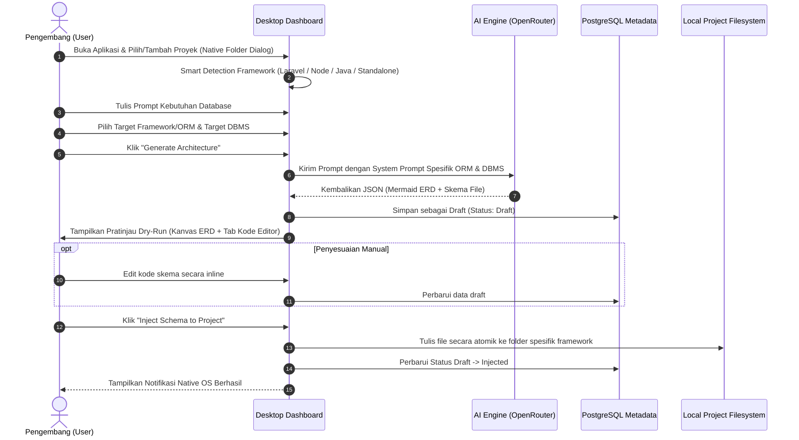

# Product Requirement Document (PRD)
## DEVArchitect: Aplikasi Desktop Generator ERD & Skema Database Multi-Framework Berbasis AI

| Informasi Dokumen | Keterangan |
|---|---|
| Nama Produk | **DEVArchitect** (Universal AI ERD & Multi-Framework Schema Generator) |
| Platform | Desktop (Windows/macOS), berbasis NativePHP |
| Versi Dokumen | 2.0 |
| Status | Disetujui (Approved) |
| Dokumen Terkait | [URD_Laravel_Migration_AI_Generator.md](file:///c:/Users/Indra/Documents/DEVArchitect/docs/URD_Laravel_Migration_AI_Generator.md) |

### Riwayat Perubahan Dokumen

| Versi | Perubahan |
|---|---|
| 1.0 | Draf awal PRD generator migrasi Laravel |
| 1.1 | Target database diubah ke Supabase (PostgreSQL) |
| 1.2 | Keputusan atas 3 pertanyaan terbuka: multi-proyek, dashboard, dan mode dry-run wajib |
| 1.3 | Dukungan multi-database dialect (MySQL, PostgreSQL, SQLite, SQL Server) |
| 2.0 | **Evolusi Universal Multi-Framework & Multi-ORM**: Re-branding menjadi **DEVArchitect**. Mendukung generasi skema & migrasi untuk **Laravel (Eloquent)**, **Express.js (Prisma & Drizzle)**, **Java Spring Boot (Hibernate/JPA)**, dan **Universal Raw SQL**. Penyesuaian arsitektur injector multi-ekosistem dan integrasi OpenRouter. |

---

## 1. Ringkasan Eksekutif

**DEVArchitect** adalah aplikasi desktop modern yang dirancang untuk mempercepat proses perancangan arsitektur database dan pembuatan skema kode bagi para software engineer. Pengguna cukup mendeskripsikan kebutuhan aplikasi dalam bahasa natural, dan AI (ditenagai oleh OpenRouter dengan model canggih seperti GPT OSS 120B) akan secara instan menghasilkan:
1. **Diagram ERD Interaktif (Mermaid.js)** untuk visualisasi relasi entitas.
2. **File Skema / Kode ORM Lengkap** yang siap pakai sesuai framework pilihan pengguna:
   - **Laravel**: Berkas migrasi PHP (`database/migrations/*.php`).
   - **Express.js / Node.js**: Skema Prisma (`schema.prisma`) atau Drizzle ORM (`schema.ts`).
   - **Java / Spring Boot**: Berkas Entity Class Hibernate/JPA (`@Entity`).
   - **Universal / Standalone**: Skrip DDL Raw SQL (`schema.sql`).

Aplikasi ini mengusung prinsip **Dry-Run**: seluruh hasil AI divisualisasikan dan dapat ditinjau serta diedit langsung di dalam aplikasi sebelum benar-benar disuntikkan (*injected*) ke dalam folder proyek lokal pengguna hanya dengan satu klik.

---

## 2. Latar Belakang & Nilai Tambah Produk

### 2.1 Masalah di Lapangan
- **Polyglot Developer**: Banyak developer dan tim software house yang bekerja di berbagai stack backend berbeda (mis. proyek A memakai Laravel, proyek B memakai Express + Prisma, proyek C memakai Java Spring Boot). Mereka harus berganti-ganti cara menulis skema database.
- **Pemisahan Desain dan Kode**: Perancangan visual di alat eksternal (seperti dbdiagram.io atau Draw.io) sering tidak terhubung langsung dengan kode proyek. Developer harus mengetik ulang entitas ke ORM secara manual, yang memakan waktu dan rawan typo.
- **Kurangnya Alat Desktop Khusus**: Sebagian besar AI tools berbasis web browser dan tidak memiliki akses filesystem lokal untuk menulis file skema langsung ke folder proyek pengembang.

### 2.2 Solusi DEVArchitect
DEVArchitect menggabungkan **AI Generatif**, **Visualizer ERD Interaktif**, dan **Akses Filesystem Native OS (via NativePHP)** ke dalam satu aplikasi desktop yang cepat, ringan, dan lintas ekosistem framework.

---

## 3. Tujuan Produk (Goals)

| Tujuan | Deskripsi |
|---|---|
| G1 | Memangkas waktu pembuatan skema database dari jam menjadi hitungan menit melalui natural language prompt. |
| G2 | Menyediakan kanvas visual ERD interaktif yang dapat diekspor ke format gambar (PNG/SVG) untuk dokumentasi tim. |
| G3 | Mendukung multi-framework & multi-ORM populer (Laravel, Prisma, Drizzle, Hibernate, Raw SQL). |
| G4 | Mendukung multi-database dialect (PostgreSQL/Supabase, MySQL, SQLite, SQL Server). |
| G5 | Menjamin keamanan kode dengan prinsip Human-in-the-Loop & Dry-Run (tidak menulis file sebelum persetujuan pengguna). |
| G6 | Menyediakan Project History Dashboard multi-proyek dengan deteksi framework cerdas. |
| G7 | Integrasi native OS profesional (Native folder dialog, System Tray, Global Hotkey `Ctrl+Alt+A`, dan Notifikasi Windows). |

### Non-Goals (Versi 1.0)
- Tidak membuat implementasi Business Logic / Controller CRUD secara otomatis (hanya struktur skema database & entity model).
- Tidak mengeksekusi migrasi database ke live server secara langsung (seperti auto-run `migrate` di terminal pengguna).
- Tidak mendukung kolaborasi real-time multi-user dalam satu kanvas (fokus pada developer desktop tool).

---

## 4. Matriks Target Framework, ORM & Output File

| Framework | ORM / Dialek | Ekstensi & Format Output | Lokasi Injeksi Default | File Signature Proyek |
|---|---|---|---|---|
| **Laravel** | Eloquent | `.php` Migration files | `database/migrations/` | `artisan`, `composer.json` |
| **Express.js / Node** | **Prisma** | `schema.prisma` | `prisma/schema.prisma` | `package.json` |
| **Express.js / Node** | **Drizzle** | `schema.ts` | `src/db/schema.ts` | `package.json` |
| **Java / Spring Boot** | **Hibernate / JPA** | `.java` Entity files | `src/main/java/.../model/` | `pom.xml`, `build.gradle` |
| **Universal / Raw SQL** | SQL DDL | `schema.sql` | Root folder proyek | Folder umum |

---

## 5. Cakupan Fitur (Feature Scope)

### 5.1 Modul 1 — Integrasi Desktop & Project Manager (NativePHP)
| Fitur | Prioritas | Deskripsi Singkat |
|---|---|---|
| **Project History Dashboard** | P0 | Menampilkan daftar seluruh proyek yang pernah didaftarkan beserta badge framework-nya |
| **Multi-Project Support** | P0 | Mengelola banyak proyek sekaligus lintas teknologi (Laravel, Node, Java, Standalone) |
| **Native Folder Picker** | P0 | Membuka dialog Windows Explorer bawaan untuk memilih direktori proyek |
| **Smart Framework Detection** | P0 | Otomatis mendeteksi tipe framework dari file penanda di dalam folder yang dipilih |
| **Global Hotkey** | P1 | Menampilkan jendela aplikasi dari mana saja dengan `Ctrl+Alt+A` |
| **System Tray** | P1 | Minimize aplikasi ke system tray agar tidak memenuhi taskbar |
| **Native OS Notification** | P1 | Notifikasi Windows saat AI selesai memproses diagram dan saat file berhasil disuntikkan |

### 5.2 Modul 2 — Generator & Universal AI Playground
| Fitur | Prioritas | Deskripsi Singkat |
|---|---|---|
| **Smart Prompt Area** | P0 | Kolom input prompt yang luas dengan panduan penulisan instruksi |
| **Target Framework Selector** | P0 | Dropdown pemilihan: Laravel, Express (Prisma), Express (Drizzle), Spring Boot (Hibernate), Raw SQL |
| **Target Database Selector** | P0 | Dropdown pemilihan: PostgreSQL (Supabase), MySQL, SQLite, SQL Server |
| **OpenRouter Engine** | P0 | Integrasi driver AI via OpenRouter (default: GPT OSS 120B / model OSS pilihan) |
| **Manajemen API Key** | P0 | Penyimpanan API Key OpenRouter secara terenkripsi di database aplikasi |
| **Asynchronous Generator** | P0 | Proses generate non-blocking dengan animasi indikator loading dan tombol pembatalan |
| **Draft Persistence** | P0 | Setiap hasil generate disimpan otomatis sebagai draft berstatus `Draft` di database |

### 5.3 Modul 3 — Visualizer ERD & Manajemen Kode (Mode Dry-Run)
| Fitur | Prioritas | Deskripsi Singkat |
|---|---|---|
| **Interactive ERD Canvas** | P0 | Render diagram relasi Mermaid interaktif dengan kontrol Pan & Zoom |
| **ERD Image Exporter** | P1 | Ekspor kanvas ERD ke file gambar PNG atau SVG |
| **Smart Code Review Tabs** | P0 | Pratinjau file kode skema dalam tab terpisah sesuai standar framework target |
| **Inline Code Editor** | P0 | Kemampuan mengedit kode migrasi/skema secara langsung sebelum injeksi |
| **Universal Schema Injector** | P0 | Menulis file fisik ke direktori proyek lokal secara atomik dan mengubah status menjadi `Injected` |
| **Deteksi Timpa File** | P1 | Peringatan cerdas jika file skema yang akan diinjeksi berpotensi menimpa file existing |
| **Generation History** | P1 | Riwayat draft dan hasil generate terdahulu per proyek |

---

## 6. Alur Pengguna Utama (Primary User Flow)

---

## 7. Pertimbangan Arsitektur Teknis

- **Backend & Desktop Engine**: Laravel 13 + NativePHP Desktop (Electron runtime).
- **Pola Desain AI (Strategy Pattern)**:
  - `DatabasePromptBuilder` & `FrameworkPromptStrategy`: Menghasilkan instruksi prompt yang berbeda secara presisi tergantung kombinasi ORM dan DBMS.
- **Pola Desain Injeksi (Universal Injector)**:
  - `LaravelInjector`: Menulis ke `database/migrations/` dengan timestamp berurutan.
  - `PrismaInjector`: Menulis ke `prisma/schema.prisma`.
  - `DrizzleInjector`: Menulis ke `src/db/schema.ts`.
  - `HibernateInjector`: Menulis ke `src/main/java/.../model/*.java`.
  - `RawSqlInjector`: Menulis ke `schema.sql`.
- **Penyimpanan Metadata**: Database relasional PostgreSQL (`Devarchitect` di Laragon untuk development, atau Supabase di production) untuk menyimpan multi-proyek dan riwayat draft.
- **Keamanan**: API Key OpenRouter disimpan menggunakan enkripsi bawaan Laravel (`encrypt()` / `decrypt()`) di tabel `app_settings`.

---

## 8. Roadmap Rilis

| Rilis | Cakupan Fitur |
|---|---|
| **v1.0** | • Project History Dashboard dengan deteksi framework cerdas. • Dukungan target framework: **Laravel (Eloquent)**, **Express (Prisma & Drizzle)**, **Java Spring Boot (Hibernate)**, dan **Raw SQL**. • Dukungan database target: PostgreSQL, MySQL, SQLite, SQL Server. • AI Engine via OpenRouter (GPT OSS 120B). • Interactive ERD Canvas (Mermaid pan/zoom) & Code Review Tab. • Universal Schema Injector (Status Draft $\rightarrow$ Injected). • Integrasi Desktop Native (Folder Picker, Window memory, dan Notifikasi OS). |
| **v1.1** | • Ekspor gambar ERD (PNG & SVG). • System Tray minimization & Global Hotkey (`Ctrl+Alt+A`). • Deteksi dan mitigasi konflik penimpaan file existing. • Dukungan framework tambahan (mis. Python/FastAPI SQLAlchemy, Go/GORM). |
| **v1.2+** | • Fitur reverse engineering: Impor dari file `.sql` atau koneksi live database untuk otomatis digenerate menjadi diagram ERD dan model ORM. |
